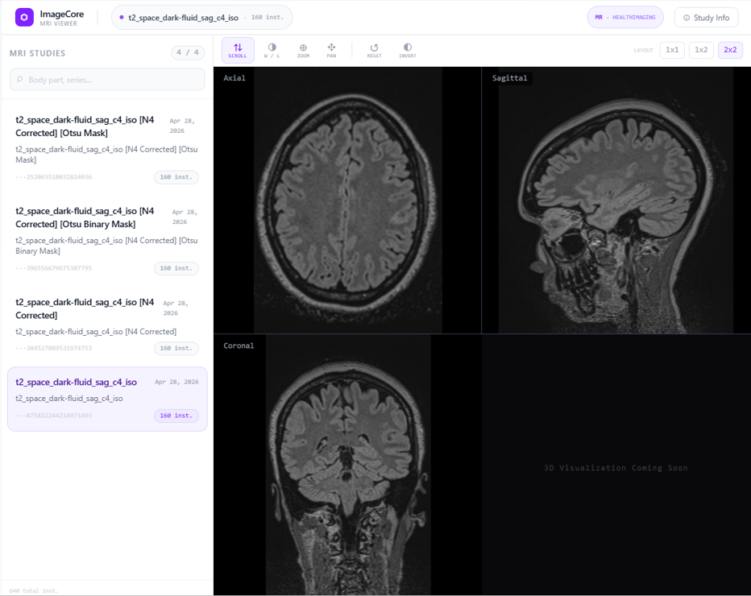
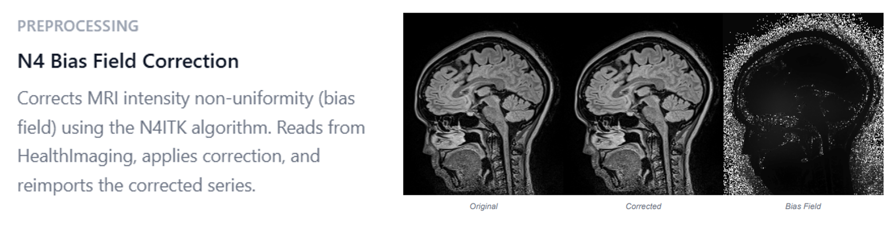
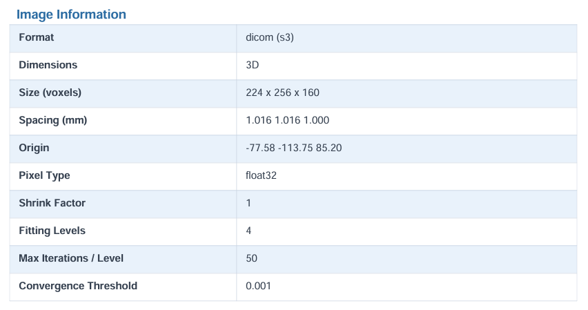
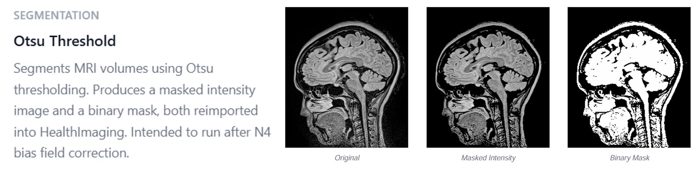

# ImageCore

A full-stack medical imaging platform for uploading, viewing, and analyzing DICOM scans. Clinicians upload studies, which are stored in Amazon S3 and imported into AWS HealthImaging. Users can then view them in the browser and run containerized image analysis tools on them, either one at a time or chained together into multi-step pipelines.

Built as a University of Iowa software engineering team project by [Brandon Rea](https://github.com/Olpheist), [Sam Motto](https://github.com/sdmotto), and [Cavan Riley](https://github.com/CavRiley).



## Features

- **Authentication and roles:** username/password registration with JWT sessions, Google sign-in, password reset, and role-based access (`ADMIN`, `CLINICIAN`, `RESEARCHER`)
- **DICOM upload:** multi-file upload to S3 with automatic AWS HealthImaging import and status tracking
- **Image catalog:** browse uploaded series with modality, body part, study date, instance count, and import status
- **DICOM viewer:** in-browser viewing built on Cornerstone3D
- **Analysis tools:** Dockerized Python tools that run as AWS ECS Fargate tasks
  - **N4 bias field correction:** corrects MRI intensity non-uniformity with the N4ITK algorithm
  - **Otsu threshold:** segments MRI volumes into a masked intensity image and a binary mask
  - **Slice report:** generates a PDF report with metadata and a representative slice
- **Tool pipelines:** chain multiple tools so each step runs on the previous step's output
- **Result tracking:** job status polling, corrected images registered back into the catalog, and downloadable PDF reports via presigned S3 URLs
- **Subscriptions:** Stripe-backed subscription tiers
- **Admin center:** user and role management, plus paginated audit logs of every API request
- **API docs:** interactive Swagger UI for every endpoint

## Analysis Tools

Each tool runs in its own container, and its output is imported back into HealthImaging as a new series. That means results show up in the catalog and viewer, and they can be used as input to the next tool.

### N4 Bias Field Correction

Corrects the low-frequency intensity non-uniformity (bias field) that MRI scanners introduce, using the N4ITK algorithm.



Each run also produces a PDF report with the image properties and the correction parameters used:



### Otsu Threshold

Segments MRI volumes with Otsu thresholding. It produces a masked intensity image and a binary mask, and it is meant to run after N4 correction as a pipeline step.



## Tech Stack

| Area | Technologies |
|---|---|
| Frontend | Nuxt 4, Vue 3, Pinia, Cornerstone3D |
| Backend | Java 17, Spring Boot 4, Spring Security (JWT, OAuth2 resource server), Spring Data JPA, Flyway, springdoc-openapi |
| Database | PostgreSQL |
| Analysis tools | Python, ITK, pydicom, Docker |
| Cloud | AWS S3, HealthImaging, ECS (Fargate), ECR, RDS, IAM |
| Infrastructure | Terraform, GitHub Actions CI/CD |
| Testing | JUnit, Cucumber (BDD), Testcontainers, pytest |
| Integrations | Stripe, SendGrid, Google OAuth |

## Architecture

1. A clinician uploads `.dcm` files. The backend stores them in S3 and starts an AWS HealthImaging import job.
2. The catalog tracks the import until the image set is `COMPLETED` and viewable.
3. When a user runs a tool, the backend launches that tool's ECS Fargate task with the input location passed through environment variables.
4. The tool container processes the DICOM data, writes corrected DICOM output and a PDF report to S3, and exits.
5. The backend polls ECS for task completion. It then re-imports the output into HealthImaging and registers it in the catalog as a new image set, so results can be viewed or analyzed further.
6. For pipelines, a completion event triggers the next step with the previous step's S3 output as its input.

All AWS infrastructure (VPC, RDS, ECS cluster, ECR repositories, S3, HealthImaging datastore, IAM roles) is defined in Terraform under [`terraform/`](terraform), and deployed through GitHub Actions.

## My Contributions

- Designed and built the **analysis job system**: ECS task dispatch, completion polling, and registration of tool output back into the image catalog
- Built the **N4 bias field correction** and **Otsu threshold** tools as Dockerized Python services, including DICOM handling, S3 output, and PDF reports
- Implemented the **tool pipeline workflow** feature: data model and migrations, sequential orchestration service driven by job completion events, REST API, and frontend modal with status polling
- Added **report downloads** through presigned S3 URLs, with UI state that persists across navigation
- Wrote Terraform and IAM changes for the tools, and a large share of the **Cucumber BDD and unit tests**

## Running Locally

**Requirements:** Node.js 24, Java 17, Docker with Docker Compose, and a Bash shell (Linux, macOS, or WSL2 on Windows)

From the repository root:

```bash
bash scripts/run_application.sh
```

This script builds the frontend, bundles it into the Spring Boot app, and starts the app and PostgreSQL with Docker Compose. Then open:

- App: [http://localhost:8080](http://localhost:8080)
- API docs: [http://localhost:8080/swagger-ui/index.html](http://localhost:8080/swagger-ui/index.html)

The local database is available at `localhost:5432` (database `imagecore`, username `imagecore`, password `imagecore`).

> [!NOTE]
> The hosted AWS deployment has been retired. Locally, registration, login, the admin center, audit logs, and tool management all work without AWS. DICOM upload, the viewer, and analysis jobs depend on S3, HealthImaging, and ECS, so they need your own AWS resources, configured through the `AWS_*` environment variables in [`application.yml`](server/src/main/resources/application.yml).

### Frontend and backend separately

```bash
# frontend dev server
cd client
npm install
npm run dev
```

For the backend, start the database with `docker-compose-dev.yml`, then run the Spring Boot app from the Gradle project in `server/`.

### Troubleshooting

If the script fails with `$'\r': command not found`, it has Windows line endings. Convert it with `dos2unix scripts/run_application.sh`, or switch the file from CRLF to LF in your editor.

## License

Licensed under the Apache License 2.0. See [`LICENSE`](LICENSE).
